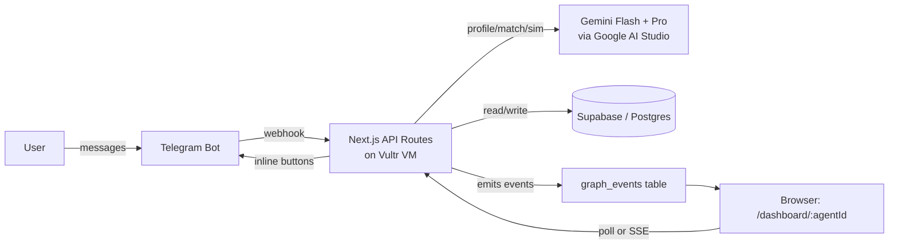
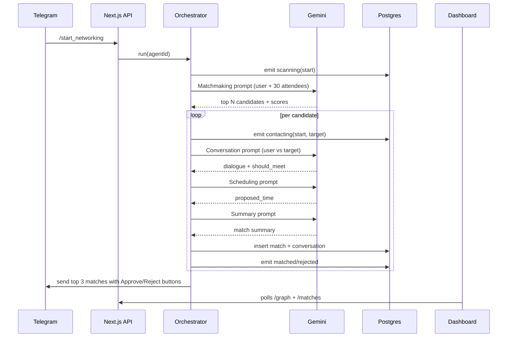

# RelAI — Technical Architecture

Messaging-first multi-agent networking platform. Source of truth for the **engineering shape** of the system. Product spec lives in `Idea.md`; hackathon requirements live in `hackathon_info.md`.

---

## 1. Goals & non-goals

### Goals

- Telegram bot is the **only** user entry point for onboarding + final approvals.
- Web "Mission Control" dashboard is the **visual proof** of multi-agent collaboration.
- All multi-agent reasoning runs as **short-lived workflows** triggered by user action — no always-on agents.
- Demo must keep working even if **Telegram or Gemini fails** (seeded fallback data).

### Non-goals (for hackathon)

- Real LinkedIn / WhatsApp / Calendar integrations.
- Persistent authentication beyond a Telegram-derived token.
- Mobile app, payments, blockchain.
- Always-running agent infrastructure.

---

## 2. High-level architecture



**One process, one VM.** Single Next.js app on Vultr handles UI, API, Telegram webhook, and Gemini orchestration. Postgres via Supabase (managed) to avoid running our own DB.

---

## 3. Tech stack

| Layer | Choice | Notes |
|---|---|---|
| Frontend | Next.js (App Router) + TypeScript | Same project as API |
| Styling | TailwindCSS + shadcn/ui | Quick polished UI |
| Graph viz | React Flow | Custom node/edge styles |
| Backend | Next.js API routes (Node runtime) | No separate FastAPI service |
| AI | Gemini Flash (extraction, fast steps) + Gemini Pro (match reasoning) | Google AI Studio API key |
| Bot | Telegram Bot API via `grammy` or `node-telegram-bot-api` | Long-polling locally, webhook in prod |
| DB | Supabase Postgres | SQL + row-level reads only; service key on server |
| Realtime | HTTP polling every 1–2s (MVP); Supabase Realtime channel (stretch) | Avoid SSE complexity unless time permits |
| Deploy | Vultr VM + Coolify (or pm2 + nginx) | Required by Vultr challenge |
| Domain/TLS | Vultr-provided subdomain or Cloudflare in front | Telegram webhook needs HTTPS |

---

## 4. Repository layout

```
/relai
├── app/
│   ├── page.tsx                 # Landing
│   ├── dashboard/[agentId]/page.tsx
│   └── api/
│       ├── telegram/webhook/route.ts
│       ├── onboarding/route.ts
│       ├── agents/
│       │   ├── create/route.ts
│       │   ├── [id]/start/route.ts
│       │   ├── [id]/status/route.ts
│       │   ├── [id]/graph/route.ts
│       │   └── [id]/matches/route.ts
│       └── matches/
│           ├── [id]/approve/route.ts
│           └── [id]/reject/route.ts
├── lib/
│   ├── gemini/                  # Prompt builders + clients
│   ├── telegram/                # Bot client + onboarding state machine
│   ├── db/                      # Supabase client + typed queries
│   ├── orchestrator/            # Workflow runner + graph_events emitter
│   └── seed/                    # Fake attendees + fallback graph script
├── components/
│   ├── graph/                   # React Flow nodes/edges
│   ├── feed/                    # Live activity feed
│   ├── matches/                 # Match cards + approve/reject
│   └── ui/                      # shadcn primitives
├── public/
├── supabase/
│   ├── schema.sql
│   └── seed.sql
├── scripts/
│   ├── seed-attendees.ts
│   └── demo-fallback.ts
├── .env.example
└── README.md
```

---

## 5. Data model

All tables in Supabase Postgres. IDs are `uuid`. Timestamps default `now()`.

### `attendees`

Fake event roster, preloaded at seed time.

| column | type | notes |
|---|---|---|
| id | uuid pk | |
| name | text | |
| role | text | |
| company | text | |
| bio | text | |
| interests | text[] | |
| goals | text | |
| availability | jsonb | array of `{start, end}` slots |
| telegram_chat_id | bigint nullable | only set after real onboarding |
| created_at | timestamptz | |

### `agents`

One per real user; created after onboarding.

| column | type | notes |
|---|---|---|
| id | uuid pk | URL-shareable agent id |
| attendee_id | uuid fk → attendees | |
| persona | jsonb | Gemini-extracted profile |
| networking_goal | text | |
| constraints | jsonb | availability, exclusions |
| status | text | `idle`/`scanning`/`contacting`/`negotiating`/`done` |
| created_at | timestamptz | |

### `matches`

| column | type | notes |
|---|---|---|
| id | uuid pk | |
| requester_id | uuid fk → agents | |
| target_id | uuid fk → attendees | |
| score | int | 0–100 |
| reason | text | |
| status | text | `pending`/`approved`/`rejected` |
| proposed_time | timestamptz nullable | |
| created_at | timestamptz | |

### `conversations`

Stored agent-to-agent simulated dialogue (one per match).

| column | type | notes |
|---|---|---|
| id | uuid pk | |
| match_id | uuid fk → matches | |
| messages_json | jsonb | array of `{speaker, message}` |
| summary | text | |
| created_at | timestamptz | |

### `graph_events`

The audit log that powers the dashboard graph + feed.

| column | type | notes |
|---|---|---|
| id | uuid pk | |
| requester_id | uuid fk → agents | |
| type | text | `scanning`/`contacting`/`negotiating`/`matched`/`rejected`/`scheduled` |
| source_node_id | text | always the requester agent id |
| target_node_id | text | attendee id |
| status | text | `start`/`end` |
| message | text | human-readable for the feed |
| created_at | timestamptz | |

Indexes: `(requester_id, created_at desc)` on `graph_events` and `matches`.

---

## 6. API contracts

All routes are Next.js API routes. JSON in/out. No auth on MVP — `agentId` in URL is the capability token.

| Method | Path | Purpose | Body / params |
|---|---|---|---|
| POST | `/api/telegram/webhook` | Receives Telegram updates | Telegram payload |
| POST | `/api/onboarding` | Persists answers, calls profile-extract prompt | `{ telegram_chat_id, answers[] }` |
| POST | `/api/agents/create` | Creates `attendees` + `agents` rows | `{ telegram_chat_id, profile }` |
| POST | `/api/agents/:id/start` | Kicks off the workflow (async) | — |
| GET  | `/api/agents/:id/status` | Returns `agents.status` + counts | — |
| GET  | `/api/agents/:id/graph` | Nodes + edges for React Flow | — |
| GET  | `/api/agents/:id/matches` | Match cards | — |
| POST | `/api/matches/:id/approve` | Marks approved, notifies Telegram | — |
| POST | `/api/matches/:id/reject` | Marks rejected, notifies Telegram | — |

### Graph response shape (frontend contract)

```ts
type GraphResponse = {
  nodes: Array<{
    id: string;
    label: string;
    role: "center" | "candidate";
    status: "idle" | "scanning" | "contacting" | "negotiating" | "matched" | "rejected";
    score?: number;
  }>;
  edges: Array<{
    id: string;
    source: string;
    target: string;
    animated: boolean;
    status: "scanning" | "contacting" | "negotiating" | "matched" | "rejected";
  }>;
  activity: Array<{ id: string; message: string; created_at: string }>;
};
```

---

## 7. Agent orchestration

Single workflow per call to `POST /api/agents/:id/start`. Runs as a server-side async function (no queue). Emits `graph_events` after each step so the dashboard animates in near-real-time.



**Concurrency:** process candidates with `Promise.all` (max ~5 parallel) to keep total wall time under ~30s.

**Cancellation:** if `agents.status` is set to `cancelled`, orchestrator exits at the next checkpoint.

### Five logical agents (collapsed to 3 Gemini calls per candidate in MVP)

| Agent role | Implementation |
|---|---|
| User Representative | Persona built once from onboarding (Flash) |
| Matchmaking | Single Flash call ranks all attendees |
| Target Representative | Folded into Conversation prompt (Pro) |
| Scheduling | Deterministic JS over availability arrays; Gemini only if needed |
| Summary | Single Pro call per accepted match |

UI still labels all five for narrative.

---

## 8. Gemini prompt library

Lives in `lib/gemini/prompts/`. Each file exports `(input) => { system, user }` and a Zod schema for the expected JSON.

| File | Model | Output schema |
|---|---|---|
| `extractProfile.ts` | Flash | `{ name, role, company, interests[], networking_goal, ideal_matches[], availability[] }` |
| `rankMatches.ts` | Flash | `{ matches: [{ attendee_id, score, reason, shared_interests[], potential_value }] }` |
| `simulateConversation.ts` | Pro | `{ conversation[], target_interest, objections[], should_meet }` |
| `summarizeMatch.ts` | Pro | `{ title, summary, why_this_match_matters, suggested_opener, meeting_agenda[], confidence_score }` |

Common helper: `callGemini(prompt, schema)` retries once on JSON parse failure with a "fix your JSON" follow-up.

---

## 9. Telegram bot

`lib/telegram/` exports a single `Bot` instance. Webhook handler in `app/api/telegram/webhook/route.ts` forwards updates to the bot.

**Onboarding state machine** (per `chat_id`, stored in `attendees.bio` + a small `onboarding_state` jsonb):

```
idle → ask_name → ask_role → ask_interests → ask_goal → ask_availability → confirm → ready
```

**Outbound messages from the orchestrator:**

- "Open Mission Control: `https://<host>/dashboard/<agentId>`"
- Final match cards as text + inline `Approve` / `Reject` buttons (callback data `approve:<matchId>` / `reject:<matchId>`).

**Webhook URL** registered once at deploy time via `setWebhook`.

---

## 10. Frontend (Mission Control)

`/dashboard/[agentId]` is a client component with three columns (responsive: stacks on mobile).

| Region | Component | Source |
|---|---|---|
| Header | `AgentStatusHeader` | `/api/agents/:id/status` |
| Left | `TelegramChatPreview` | Static mock w/ live last message |
| Center | `AgentGraph` (React Flow) | `/api/agents/:id/graph` polled every 1.5s |
| Right top | `ActivityFeed` | Same payload — `activity[]` |
| Right bottom | `MatchCards` w/ Approve/Reject | `/api/agents/:id/matches` |

**Animation rules:** edges set `animated: true` while their event is `contacting`/`negotiating`. Node color follows the status enum (see `Idea.md` §React Flow Visualization).

**Fallback:** if `/api/agents/:id/graph` returns empty for >5s after start, dashboard plays a **scripted demo sequence** from `lib/seed/demo-fallback.ts` so live demos never look dead.

---

## 11. Deployment

Per `hackathon_info.md` Vultr requirements:

1. Vultr VM (smallest viable, e.g. 2 vCPU / 4 GB).
2. Install Docker; run **Coolify** (recommended in workshops) OR `pm2` + `nginx`.
3. Deploy Next.js app, point Coolify at the GitHub repo.
4. Issue TLS cert via Let's Encrypt (Coolify automates this).
5. Set Telegram webhook to `https://<domain>/api/telegram/webhook`.
6. Supabase managed instance — only the service-role key sits on the VM.
7. Record demo video; capture public URL for submission.

**Secrets via `.env`** (see `.env.example` for the full list with comments):

```
NEXT_PUBLIC_APP_URL=
GEMINI_API_KEY=
TELEGRAM_BOT_TOKEN=
NEXT_PUBLIC_SUPABASE_URL=
NEXT_PUBLIC_SUPABASE_PUBLISHABLE_KEY=
SUPABASE_DATABASE_PASSWORD=
SUPABASE_SECRET_KEY=
```

**Supabase key model (new projects):**

| Key | Where it's used | Bypass RLS? |
|---|---|---|
| `NEXT_PUBLIC_SUPABASE_PUBLISHABLE_KEY` | Browser + server reads | No — gated by RLS policies |
| `SUPABASE_SECRET_KEY` | Server-side writes (orchestrator, API routes) | Yes |
| `SUPABASE_DATABASE_PASSWORD` | `supabase db push`, `psql`, seed scripts | N/A (direct Postgres connection) |

The publishable key replaces the legacy "anon key" and the secret key replaces the legacy "service_role key". Both legacy names still work for older projects.

---

## 12. Demo reliability

- 30–50 seeded attendees in `attendees` table covering archetypes from `Idea.md` §Fake Data.
- `scripts/demo-fallback.ts` can be run from a button on the dashboard (or auto-triggered) to emit a pre-baked sequence of `graph_events` and `matches`.
- All Gemini calls wrapped in `tryWithFallback(prompt, cachedResponseJson)` so a network failure during the demo doesn't break the flow.
- Telegram bot has a `/demo` command that runs the full pipeline against a fixed fake user — for stage demos without onboarding.

---

## 13. Risks & mitigations

| Risk | Mitigation |
|---|---|
| Gemini latency >30s | Parallelize candidates; cap candidates at 5; use Flash where possible |
| Telegram webhook flakiness | Long-polling fallback in dev; pre-recorded demo video as backup |
| Match copy feels generic | Invest prompt budget in `simulateConversation` + `summarizeMatch`; show one transcript on the UI |
| Vultr deploy lag near deadline | Deploy a "hello world" Next.js app on day 1; iterate on top of working infra |
| Telegram ↔ dashboard identity | `agentId` is a UUID returned in the bot message; no extra auth required |

---

## 14. Submission deliverables (mapped to `hackathon_info.md`)

- [ ] Public GitHub repository (MIT license)
- [ ] Vultr VM deployment + public URL
- [ ] Demo video (≤3 min) showing: landing → Telegram bot → dashboard animation → approval → Telegram confirm
- [ ] Cover image + slide deck
- [ ] Short + long description on lablab.ai with tags: **Collaborative Systems** (main), Agentic Workflows, Enterprise Utility, **Gemini**, **Vultr**
